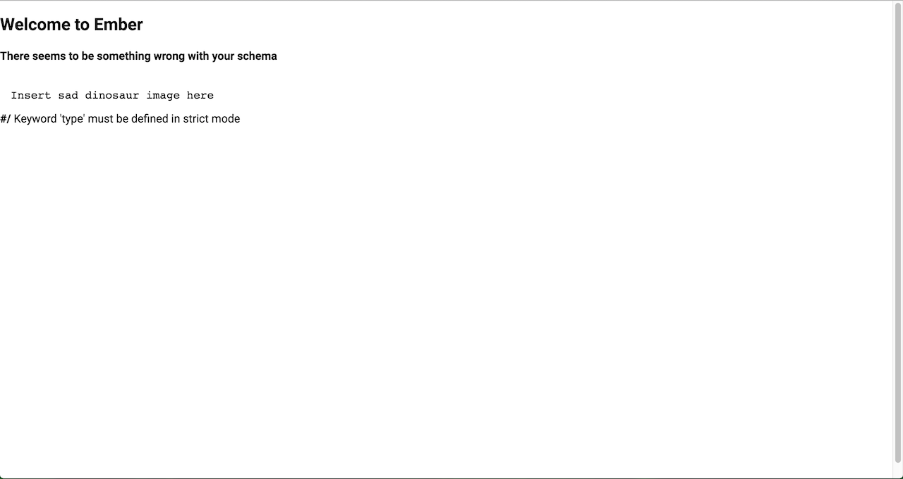
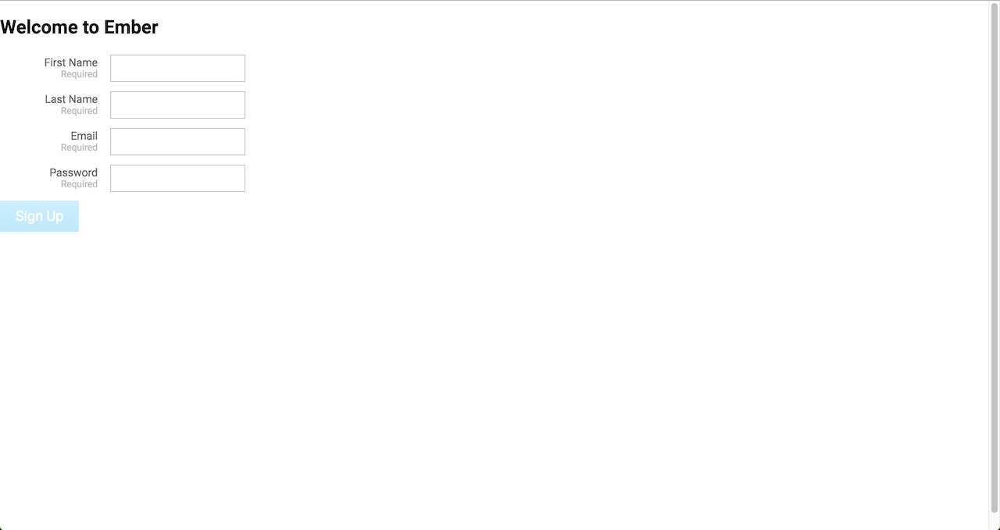
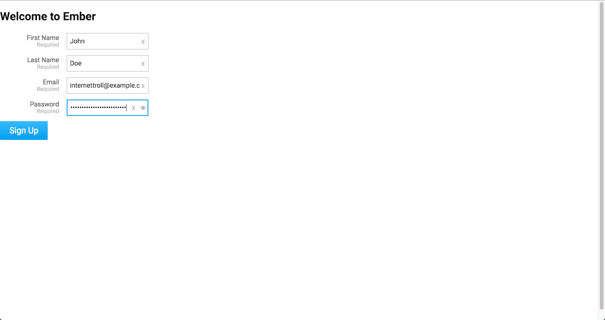
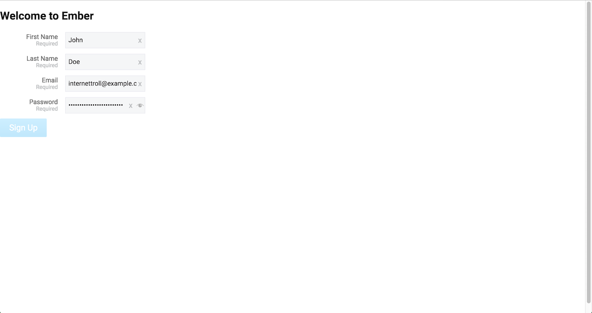
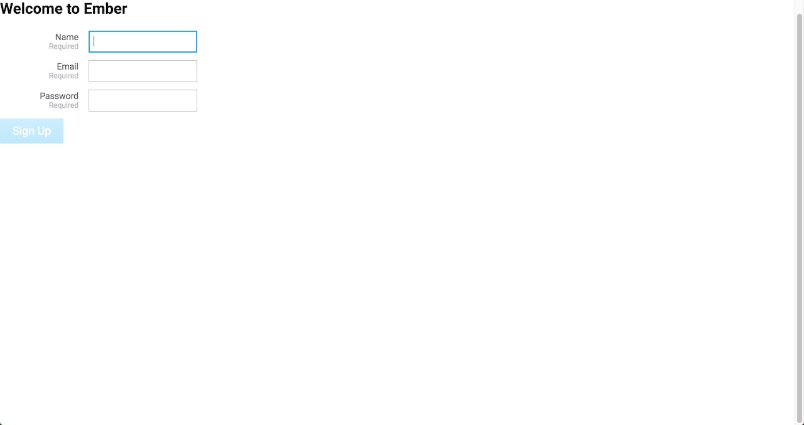
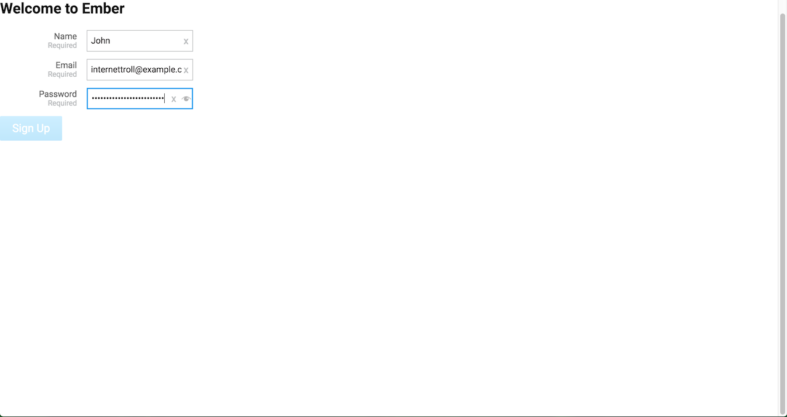
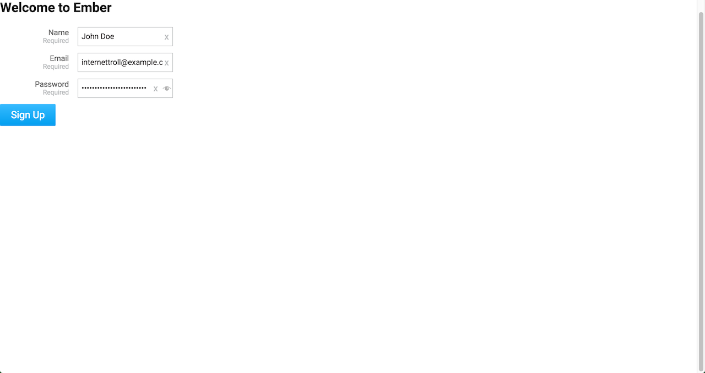
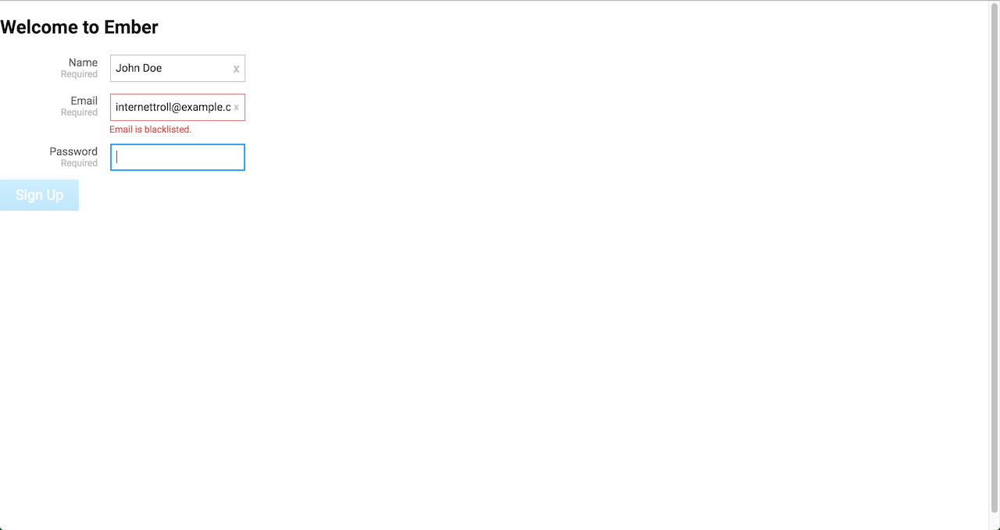

# Learn ember-frost-bunsen

[![Travis][ci-img]][ci-url]

## Table of Contents

* [Getting Started](#getting-started)
  * [Initialize Application](#initialize-application)
  * [Install ember-frost-bunsen](#install-ember-frost-bunsen)
  * [Setup Application](#setup-application)
  * [Create Sign Up Form](create-sign-up-form)
    * [Create Model](#create-model)
    * [Create View](#create-view)
    * [Add Submit Button](#add-submit-button)
    * [Disable Form During Submission](#disable-form-during-submission)
    * [Custom Renderer](#custom-renderer)
    * [Custom Validator](#custom-validator)

## Getting Started

This tutorial will show you how to get started with `ember-frost-bunsen` by having you create a new application with a bunsen form for creating a new user account. You won't actually wire this form up to an API but will learn step-by-step how to go about creating this form in an intuitive process. Ideally after following this tutorial you will have the knowledge necessary to start using `ember-frost-bunsen` within your own application and generate the beautiful forms you desire.

### Initialize Application

First let's create a new Ember application to get started:

```bash
ember new bunsen-tutorial && cd bunsen-tutorial
```

### Install `ember-frost-bunsen`

Now that we have an Ember application let's install `ember-frost-bunsen`:

```bash
ember install ember-frost-bunsen
```

Go ahead and run the application and verify it works:

```bash
ember serve
```

Verify your [local instance](http://localhost:4200) is running and you get the following:


### Setup Application

Now that we have initialized our project we can start by creating a new route for the sign up page:

```bash
ember g route signup
```

Now let's create a template for our index and add a link to the sign up page:

```bash
ember g template index
```

*app/templates/index.hbs*

```handlebars
{{#frost-link 'signup'
  priority='secondary'
  size='small'
}}
  Sign Up
{{/frost-link}}
```

Now your page should look like following:


### Create Sign Up Form

Now that we have our application and routes setup we can start digging into creating forms with bunsen.

Let's start by placing the `frost-bunsen-form` component on our sign up page. If you read the documentation for this component you will find that it has a required `bunsenModel` property so let's go ahead and initialize that with a property we will end up adding to our controller.

*app/templates/signup.hbs*

```handlebars
{{frost-bunsen-form
  bunsenModel=bunsenModel
}}
```

If you go ahead and try to visit the `signup` route in your browser you will find the following warning in your console:


> NOTE: You may also see an Error in the console which can be disregarded as it has to do with bunsen trying to process a model that isn't currently present.

#### Create Model

The above warning is because `frost-bunsen-form` expects the model property to be either an Ember Object or a plain JavaScript Object and currently it is undefined since we haven't defined it in our controller. Let's go ahead and create our controller and add this property to it:

```bash
ember g controller signup
```

*app/controllers/signup.js*

```js
import Ember from 'ember';

export default Ember.Controller.extend({
  bunsenModel: {}
});
```

Now if you visit your browser you will see the following:



This error is because the model is expected to be valid JSON Schema. This tutorial is not going to go into what JSON Schema is but [here](http://spacetelescope.github.io/understanding-json-schema/) is a good place to go if you need to learn more about it.

Let's go ahead and update our model to be valid JSON schema for representing our sign up form:

*app/controllers/signup.js*

```js
import Ember from 'ember';

export default Ember.Controller.extend({
  bunsenModel: {
    properties: {
      email: {
        format: 'email',
        type: 'string'
      },
      name: {
        properties: {
          first: {type: 'string'},
          last: {type: 'string'}
        },
        required: ['first', 'last'],
        type: 'object'
      },
      password: {
        type: 'string'
      }
    },
    required: ['email', 'name', 'password'],
    type: 'object'
  }
});
```

The above model shouldn't be too hard to comprehend as it is JSON Schema for an Object in the following format:

```json
{
  "email": "internettroll@example.com",
  "name": {
    "first": "John",
    "last": "Doe"
  },
  "password": "correcthorsebatterystaple"
}
```

Now you should see the following in your browser:


#### Create View

The above screenshot shows how easy it is to get a functioning form but it doesn't look as nice as we'd like. This is where bunsen views come into play.

Let's go ahead and update our sign up template to pass a view into the `frost-bunsen-form` component:

*app/templates/signup.hbs*

```handlebars
{{frost-bunsen-form
  bunsenModel=bunsenModel
  bunsenView=bunsenView
}}
```

Next we need to define this view in our controller:

*app/controllers/signup.js*

```js
import Ember from 'ember';

export default Ember.Controller.extend({
  bunsenModel: …,
  bunsenView: {
    containers: [
      {
        id: 'main',
        rows: [
          [
            {
              label: 'First Name',
              model: 'name.first'
            }
          ],
          [
            {
              label: 'Last Name',
              model: 'name.last'
            }
          ],
          [
            {
              model: 'email'
            }
          ],
          [
            {
              model: 'password',
              properties: {
                type: 'password' // Render input as a password input instead of default text input
              }
            }
          ]
        ]
      }
    ],
    rootContainers: [
      {
        container: 'main',
        label: 'Main'
      }
    ],
    type: 'form',
    version: '1.0'
  }
});
```

In the above view JSON the `type` and `version` properties are always present and as of today always contain the values `form` and `1.0`. These properties exist so bunsen can be extended more in the future without breaking views from older versions. `rootContainers` informs bunsen which container(s) should be rendered on the form; if more than one is present it will render them as tabs with the `label` for each being used as the text on the tab. `containers` is an array of named containers where `id` represents the containers unique name. Each container must have a `rows` attribute which is an array of rows, with each row being an array of cells. These cells look similar to containers without the `id` attribute and inform bunsen what to render from the model. This is achieved via the `model` attribute which uses dot-notation of where the field lives within the model.

Now that we have defined a custom view you should see the following in your browser:


#### Add Submit Button

Now that we have a decent looking form let's add a submit button that is only enabled when the form is valid. In order to achieve this we will leverage the `onValidation` property of the `frost-bunsen-form` component.

*app/templates/signup.hbs*

```handlebars
{{frost-bunsen-form
  bunsenModel=bunsenModel
  bunsenView=bunsenView
  onValidation=(action "formValidation")
}}
{{frost-button
  disabled=isFormInvalid
  priority="primary"
  size="medium"
  text="Sign Up"
}}
```

*app/controllers/signup.js*

```js
import Ember from 'ember';

export default Ember.Controller.extend({
  bunsenModel: …,
  bunsenView: …,
  isFormInvalid: true,

  actions: {
    formValidation (validation) {
      this.set('isFormInvalid', validation.errors.length !== 0);
    }
  }
});
```

Now you should see the following in your browser:



Once you fill out the form so that it becomes valid you will notice that the submit button becomes enabled:



Now that we have a submit button that becomes enabled when the form is valid we ideally want it to submit the form value to some backend API. We will go ahead and wire it up in this demo to simply present the form value via an alert. To get the form value we will leverage the `onChange` property of the `frost-bunsen-form`.

*app/templates/signup.hbs*

```handlebars
{{frost-bunsen-form
  bunsenModel=bunsenModel
  bunsenView=bunsenView
  onChange=(action "formChange")
  onValidation=(action "formValidation")
}}
{{frost-button
  disabled=isFormInvalid
  onClick=(action "submitForm")
  priority="primary"
  size="medium"
  text="Sign Up"
}}
```

*app/controllers/signup.js*

```js
import Ember from 'ember';

export default Ember.Controller.extend({
  bunsenModel: …,
  bunsenValue: null,
  bunsenView: …,
  isFormInvalid: true,

  actions: {
    formChange (value) {
      this.set('bunsenValue', value);
    },
    formValidation (validation) {
      this.set('isFormInvalid', validation.errors.length !== 0);
    },
    submitForm () {
      const value = this.get('bunsenValue');
      alert(JSON.stringify(value, null, 2));
    }
  }
});
```

Now you should see the following alert when you fill out the form and press the submit button:


#### Disable Form During Submission

In the event you have the form wired up to a real backend you may want to disable the form while you are waiting for the API request to complete. For this demo let's make the submission wait a few seconds before presenting the alert and during that time disable the entire form in an effort to simulate a slow API request. We will leverage the `disabled` property of the `frost-bunsen-form` component to disable the form. We will also update the disabled property of our submit button so that it is disabled whenever the form is invalid or the submission is in flight.

*app/templates/signup.hbs*

```handlebars
{{frost-bunsen-form
  bunsenModel=bunsenModel
  bunsenView=bunsenView
  disabled=isFormDisabled
  onChange=(action "formChange")
  onValidation=(action "formValidation")
}}
{{frost-button
  disabled=(or isFormDisabled isFormInvalid)
  onClick=(action "submitForm")
  priority="primary"
  size="medium"
  text="Sign Up"
}}
```

*app/controllers/signup.js*

```js
import Ember from 'ember';

export default Ember.Controller.extend({
  bunsenModel: …,
  bunsenValue: null,
  bunsenView: …,
  isFormDisabled: false,
  isFormInvalid: true,

  actions: {
    formChange (value) {
      this.set('bunsenValue', value);
    },
    formValidation (validation) {
      this.set('isFormInvalid', validation.errors.length !== 0);
    },
    submitForm () {
      this.set('isFormDisabled', true);

      Ember.run.later(() => {
        const value = this.get('bunsenValue');
        alert(JSON.stringify(value, null, 2));
        this.set('isFormDisabled', false);
      }, 3000);
    }
  }
});
```

Now when you submit the form you should see the following for a few seconds before the alert appears:



Once you see the alert appear you will notice the form becomes enabled again.

#### Custom Renderer

Now that you know the basics let's create a custom renderer to use a single text input for the user's full name.

```bash
ember g component name-renderer
```

For our custom renderers template we will simply copy the [template](https://github.com/ciena-frost/ember-frost-bunsen/blob/master/app/templates/components/frost-bunsen-input-text.hbs) for `ember-frost-bunsen`'s builtin text input and replace `transformedValue` with `renderValue`:

*app/templates/components/name-renderer.hbs*

```handlebars
<div>
  <div class={{labelWrapperClassName}}>
    <label class="alias">{{renderLabel}}</label>
    {{#if required}}
      <div class='required'>Required</div>
    {{/if}}
  </div>
  <div class={{inputWrapperClassName}}>
    {{frost-text
      class=inputClassName
      disabled=disabled
      onBlur=(action "onBlur")
      onFocus=(action "onFocus")
      onInput=(action "onChange")
      placeholder=cellConfig.placeholder
      type=inputType
      value=(readonly renderValue)
    }}
  </div>
</div>
{{#if renderErrorMessage}}
  <div>
    <div class={{labelWrapperClassName}}></div>
    <div class="error">
      {{renderErrorMessage}}
    </div>
  </div>
{{/if}}
```

Our custom renderer will extend the **AbstractInput** component provided by `ember-frost-bunsen` and override the methods `parseValue` as well as provide a computed property `renderValue`:

*app/components/name-renderer.js*

```js
import Ember from 'ember';
import {AbstractInput} from 'ember-frost-bunsen';

export default AbstractInput.extend({
  classNames: ['frost-field'],

  renderValue: Ember.computed('transformedValue', function () {
    const name = this.get('transformedValue');

    if (!name) {
      return '';
    }

    const first = name.first || '';
    const last = name.last || '';
    const space = this.get('trailingSpace') || name.last ? ' ' : '';

    return `${first}${space}${last}`;
  }).readOnly(),

  parseValue (target) {
    const parts = target.value.split(' ');
    const trailingSpace = / $/.test(target.value);

    this.set('trailingSpace', trailingSpace);

    return {
      first: parts[0],
      last: (parts.length > 1) ? parts.slice(1).join(' ') : undefined
    };
  }
});
```

In the above code the `renderValue` computed property takes the *first* and *last* name of the name Object and returns a string in the format `<First_Name> <Last_Name>` (ie `John Doe`). The `parseValue` method does the opposite and converts the string back into the Object form.

Now that we have a custom renderer we need to update our view to render the name property with our custom renderer rather than both the first and last name properties individually:

*app/controller/signup.js*

```js
import Ember from 'ember';

export default Ember.Controller.extend({
  bunsenModel: …,
  bunsenValue: null,
  bunsenView: {
    containers: [
      {
        id: 'main',
        rows: [
          [
            {
              model: 'name',
              renderer: 'name-renderer'
            }
          ],
          [
            {
              model: 'email'
            }
          ],
          [
            {
              model: 'password',
              properties: {
                type: 'password' // Render input as a password input instead of default text input
              }
            }
          ]
        ]
      }
    ],
    rootContainers: [
      {
        container: 'main',
        label: 'Main'
      }
    ],
    type: 'form',
    version: '1.0'
  },
  isFormDisabled: false,
  isFormInvalid: true,

  actions: {
    …
  }
});
```

Now in your browser you should see:



Now fill out the form while only providing a first name in the name input and notice the form doesn't allow submission:



Now add the last name and notice the form will now allow submission:



When you submit the form you will get the same alert as before with the `first` and `last` name as separate properties of `name`:


#### Custom Validator

Now maybe you want to blacklist certain email addresses or even entire domains due to spam. Lets go ahead and create an email blacklist:

*app/fixtures/email-blacklist.js*

```js
export default [
  // Blacklist internet trolls
  'internettroll@example.com',

  // Blacklist certain government organizations (tin-foil hats welcome)
  'fbi.gov',
  'cia.gov'
];
```

Now that we have a blacklist lets add a custom validator so our form checks emails against this list.

First we will need to pass our custom validator to the `frost-bunsen-form` component:

*app/templates/signup.hbs*

```handlebars
{{frost-bunsen-form
  bunsenModel=bunsenModel
  bunsenView=bunsenView
  disabled=isFormDisabled
  onChange=(action "formChange")
  onValidation=(action "formValidation")
  validators=bunsenValidators
}}
{{frost-button
  disabled=(or isFormDisabled isFormInvalid)
  onClick=(action "submitForm")
  priority="primary"
  size="medium"
  text="Sign Up"
}}
```

We will also need to add our custom validator to the controller:

*app/controllers/signup.js*

```js
import Ember from 'ember';
import emailBlacklist from 'bunsen-tutorial/fixtures/email-blacklist';

function emailValidator (formValue) {
  const length = emailBlacklist.length;
  const response = {
    value: {
      errors: [],
      warnings: []
    }
  };

  if (!formValue.email) {
    return Ember.RSVP.resolve(response);
  }

  for (let i = 0; i < length; i++) {
    if (formValue.email.indexOf(emailBlacklist[i]) !== -1) {
      response.value.errors.push({
        message: 'Email is blacklisted.',
        path: '#/email'
      });
      break;
    }
  }

  return Ember.RSVP.resolve(response);
}

export default Ember.Controller.extend({
  bunsenModel: …,
  bunsenValidators: [
    emailValidator
  ],
  bunsenValue: null,
  bunsenView: …,
  isFormDisabled: false,
  isFormInvalid: true,

  actions: {
    …
  }
});
```

You will notice our custom validator is simply a function that returns a Promise with an Object of a particular format. This Object contains the key `value` which is an Object containing both `errors` and `warnings`. Each error/warning should be an Object with the keys `message` and `path` where message is the `message` to be displayed in the UI and `path` is the JSON Schema path to the invalid property. Since this function returns a Promise you can do things like make an API request to check if a user is already registered with the provided email. Each validator function is given the entire form value as the first argument.

The `validators` property passed into `frost-bunsen-form` is simply an array of validator functions.

With the above you should see:



[ci-img]: https://img.shields.io/travis/ciena-frost/bunsen-tutorial.svg "Travis CI Build Status"
[ci-url]: https://travis-ci.org/ciena-frost/bunsen-tutorial
