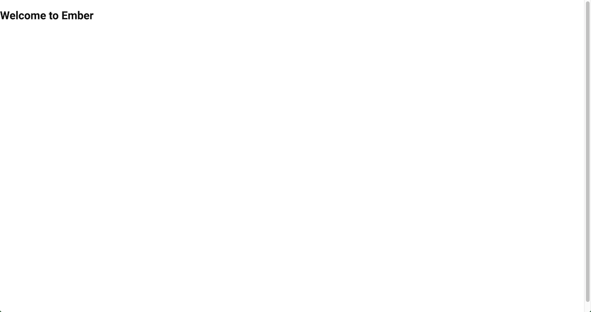
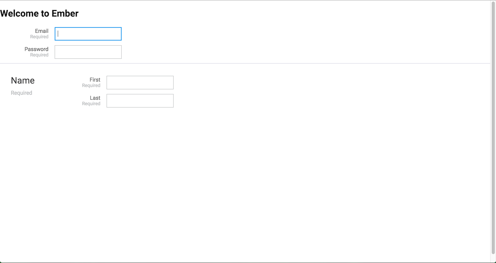
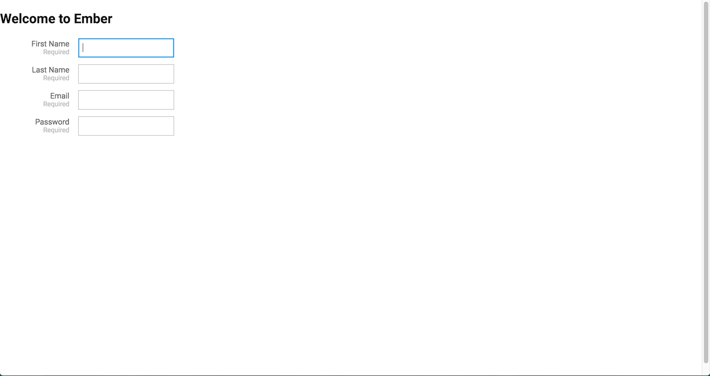

# Learn ember-frost-bunsen

## Getting Started

This tutorial will show you how to get started with `ember-frost-bunsen` by having you create a new application with a bunsen form for creating a new user account. You won't actually wire this form up to an API but will learn step-by-step how to go about creating this form in an intuitive process. Ideally after following this tutorial you will have the knowledge necessary to start using `ember-frost-bunsen` within your own application and generate the beautiful forms you desire.

### Initialize application

First lets create a new Ember application to get started:

```bash
ember new bunsen-demo && cd bunsen-demo
```

### Install `ember-frost-bunsen`

Now that we have an Ember application lets install `ember-frost-bunsen`:

```bash
ember install ember-frost-bunsen
```

Go ahead and run the application and verify it works:

```bash
ember serve
```

Verify your [local instance](http://localhost:4200) is running and you get the following:



### Setup Application

Now that we have initialized our project we can start by creating a new route for the sign up page:

```bash
ember g route signup
```

Now lets create a template for our index and add a link to the sign up page:

```bash
ember g template index
```

*app/templates/index.hbs*

```handlebars
{{#frost-link 'signup'
  priority='secondary'
  size='small'
}}
  Sign Up
{{/frost-link}}
```

Now your page should look like following:


### Create Sign Up Form

Now that we have our application and routes setup we can start digging into creating forms with bunsen.

We are going to need a controller for our signup route so lets create one:

```bash
ember g controller signup
```

Lets start by placing the `frost-bunsen-form` component on our sign up page. If you read the documentation for this component you will find that it has a required `bunsenModel` property so lets go ahead and initialize that with a property we will end up adding to our controller.

*app/templates/signup.hbs*

```handlebars
{{frost-bunsen-form
  bunsenModel=bunsenModel
}}
```

If you go ahead and try to visit the signup route in your browser you will find the following warning in your console:


#### Create Model

This is because `frost-bunsen-form` expects the model property to be either an Ember Object or a plain JavaScript Object and currently it is undefined since we haven't defined it in our controller. Lets go ahead and do that now:

*app/controllers/signup.js*

```js
import Ember from 'ember';

export default Ember.Controller.extend({
  bunsenModel: {}
});
```

Now if you run this in your browser you will see the following:


This error is because the model is expected to be valid JSON Schema. This tutorial is not going to go into what JSON Schema is but [here](http://spacetelescope.github.io/understanding-json-schema/) is a good place to go if you need to learn more about it.

Lets go ahead and update our model to be valid JSON schema for representing our signup form:

*app/controllers/signup.js*

```js
import Ember from 'ember';

export default Ember.Controller.extend({
  bunsenModel: {
    properties: {
      email: {
        format: 'email',
        type: 'string'
      },
      name: {
        properties: {
          first: {type: 'string'},
          last: {type: 'string'}
        },
        required: ['first', 'last'],
        type: 'object'
      },
      password: {
        type: 'string'
      }
    },
    required: ['email', 'name', 'password'],
    type: 'object'
  }
});
```

The above model shouldn't be too hard to comprehend as it is JSON Schema for an Object in the following format:

```json
{
  "email": "internettroll@example.com",
  "name": {
    "first": "John",
    "last": "Doe"
  },
  "password": "correcthorsebatterystaple"
}
```

Now you should see the following in your browser:



#### Create View

The above screenshot shows how easy it is to get a functioning form but it doesn't look as nice as we'd like. This is where bunsen views come into play.

Lets go ahead and update our signup template to pass a view into the `frost-bunsen-form` component:

*app/templates/signup.hbs*

```handlebars
{{frost-bunsen-form
  bunsenModel=bunsenModel
  bunsenView=bunsenView
}}
```

Next we need to define this view in our controller:

*app/controllers/signup.js*

```js
import Ember from 'ember';

export default Ember.Controller.extend({
  bunsenModel: …,
  bunsenView: {
    containers: [
      {
        id: 'main',
        rows: [
          [
            {
              label: 'First Name',
              model: 'name.first'
            }
          ],
          [
            {
              label: 'Last Name',
              model: 'name.last'
            }
          ],
          [
            {
              model: 'email'
            }
          ],
          [
            {
              model: 'password',
              properties: {
                type: 'password' // Render input as a password input instead of default text input
              }
            }
          ]
        ]
      }
    ],
    rootContainers: [
      {
        container: 'main',
        label: 'Main'
      }
    ],
    type: 'form',
    version: '1.0'
  }
});
```

In the above view JSON the `type` and `version` properties are always present and as of today always contain the values `form` and `1.0`. These properties exist so bunsen can be extended more in the future without breaking views from older versions. `rootContainers` informs bunsen which container(s) should be rendered on the form; if more than one is present it will render them as tabs with the `label` for each being used as the text on the tab. `containers` is an array of named containers where `id` is where the containers unique name is found. Each container must have a `rows` attribute which is an array of rows, with each row being an array of cells. These cells look similar to containers without the `id` attribute and inform bunsen what to render from the model. This is achieved via the `model` attribute which uses dot-notation of where the field lives within the model.

Now that we have defined a custom view you should see the following in your browser:



#### Creating Submit Button

Now that we have a decent looking form lets create a submit button that is only enabled when the form is valid. In order to achieve this we will leverage the `onValidation` property for the `frost-bunsen-form` component.

*app/templates/signup.hbs*

```handlebars
{{frost-bunsen-form
  bunsenModel=bunsenModel
  bunsenView=bunsenView
  onValidation=(action "formValidation")
}}
{{frost-button
  disabled=isFormInvalid
  priority="primary"
  size="medium"
  text="Sign Up"
}}
```

*app/controllers/signup.js*

```js
import Ember from 'ember';

export default Ember.Controller.extend({
  bunsenModel: …,
  bunsenView: …,
  isFormInvalid: true,

  actions: {
    formValidation (validation) {
      this.set('isFormInvalid', validation.errors.length !== 0)
    }
  }
});
```

Now you should see the following in your browser:


*Rest of tutorial coming soon…*
